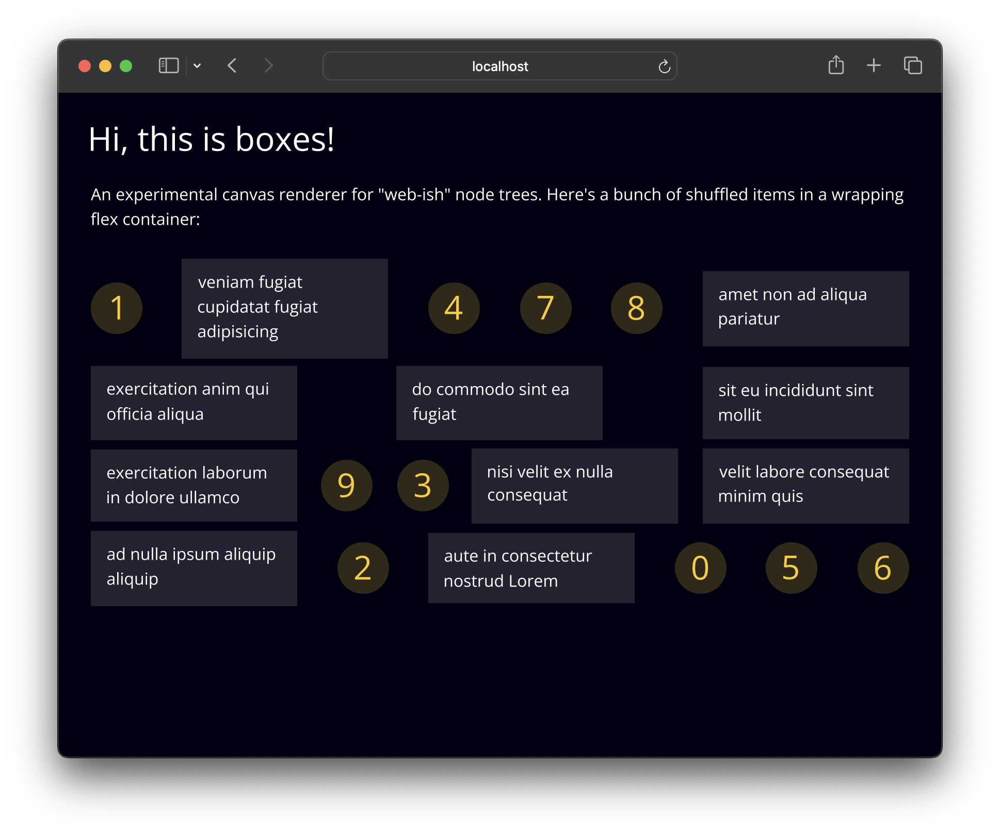
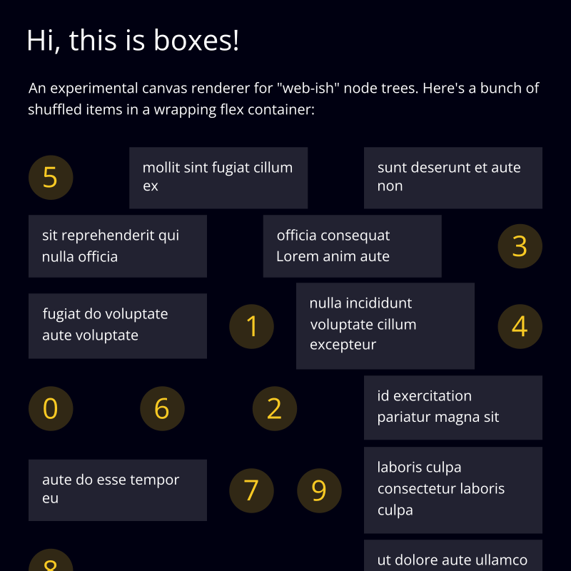

# Boxes

An experimental canvas renderer for "web-ish" node trees



Current features:

- Custom style tree with inheritance inspired by CSS
- Multi-line text with wrapping via [opentype.js]()
- Flexbox layout via [yoga](https://www.yogalayout.dev/)
- Works in browsers and with [node-canvas](https://www.npmjs.com/package/canvas)

**Note:** Boxes is an early work in progress and all APIs are subject to change at any time.

## Example

This image above was generated with `test/main-shared.ts`, boxes takes a node tree describing the scene and renders it to a canvas, here's the code for this scene:

```ts
const pageStyle: Partial<StyleData> = {
  padding: 32, gap: 32, bg: '#001', color: '#fff'
};

const containerStyle: Partial<StyleData> = {
  dir: 'row', wrap: true, gap: 8,
  justifyContent: 'space-between', alignItems: 'center',
};

const numberStyle: Partial<StyleData> = {
  bg: '#f9ca2433', color: '#f9ca24', 
  justifyContent: 'center', alignItems: 'center',
  fontSize: 32, width: 50, aspectRatio: 1, borderRadius: 25,
};

const loremStyle: Partial<StyleData> = {
  bg: '#fff2', fontSize: 16, padding: 16, width: 200,
};

const innerContent = () => {
  const items = repeat(10, (i) => [
    box(numberStyle, [text({ fontSize: 32 }, i.toString())]),
    text(loremStyle, lorem())
  ]);
  return shuffle(items.flat());
};

export const scene = () => {
  return box(pageStyle, [
    text({ fontSize: 32 }, 'Hi, this is boxes!'),
    text({ fontSize: 16 }, `An experimental canvas renderer for "web-ish" node trees. Here's a bunch of shuffled items in a wrapping flex container:`),
    box(containerStyle, innerContent()),
  ]);
};
```

With `test/main-node.ts`, the same scene can be rendered to a file, without the browser:


